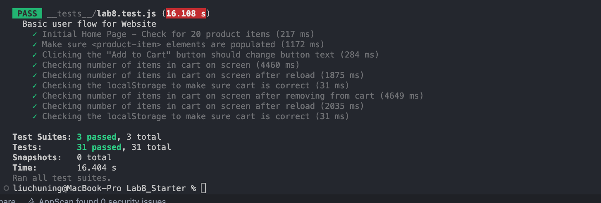
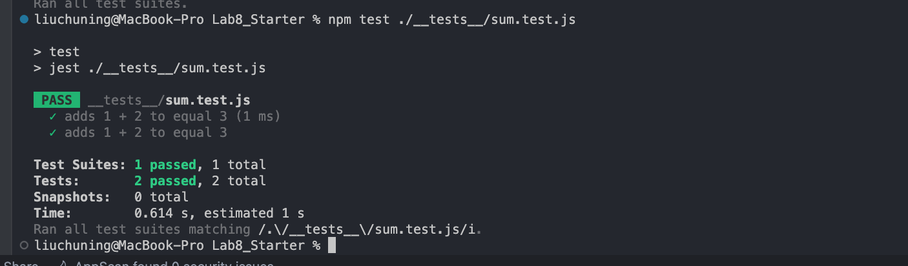
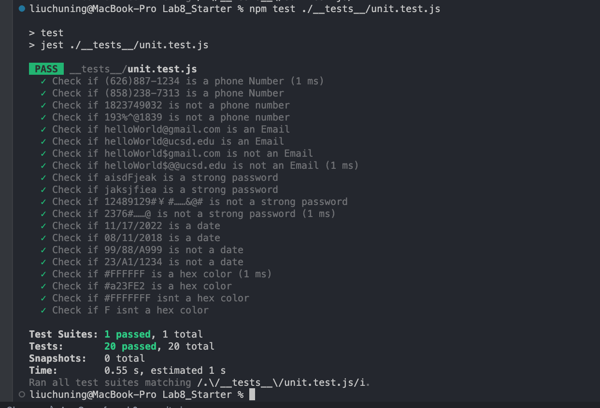

# Lab 8 - Starter
## 1) Where would you fit your automated tests in your Recipe project development pipeline? Select one of the following and explain why.

1. Within a Github action that runs whenever code is pushed 
   * No.1 is the answer. Because this test ensures that the code can be tested automatically every time it is pushed to the github repository, preventing code crashes. It also allows team members to check the cause of code crashes in time for them to discuss and make changes.

## 2) Would you use an end to end test to check if a function is returning the correct output? (yes/no)
* This doesn't really require an E2E test, but rather a unit test. Since this is really just testing whether a function returns the correct value, a unit test is more appropriate than an E2E test.

## 3) Would you use a unit test to test the “message” feature of a messaging application? Why or why not? For this question, assume the “message” feature allows a user to write and send a message to another user.
* This is because the message function function mainly allows the user to write and send. These functions require different formations to connect and interact. So we can't use unit tests.

## 4) Would you use a unit test to test the “max message length” feature of a messaging application? Why or why not? For this question, assume the “max message length” feature prevents the user from typing more than 80 characters.
* Yes, unit testing is needed for this function. Because it is a small function. He only needs to test if the user input is more than 80 characters. So we only need a unit test to detect whether this function is correct or not.

## Lab8.js test screen shoot
Here is the lab8 image:

## sum.js test screen shoot
Here is the sum.test image:

## unit.js test screen shoot
Here is the unit.test image:

